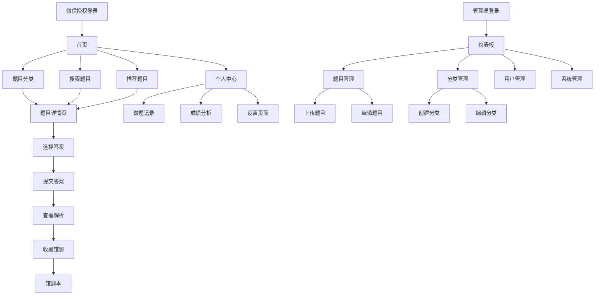

# 刷刷题微信小程序项目产品需求文档

## 1. 产品概述

刷刷题是一个基于微信小程序的在线题库学习平台，为用户提供便捷的刷题学习体验。
- 解决用户随时随地刷题学习的需求，支持多学科题库分类管理，提供个性化学习记录和错题本功能。
- 目标用户包括各类考试备考人员，如法考、医考等专业考试学习者，提升学习效率和考试通过率。

## 2. 核心功能

### 2.1 用户角色

| 角色 | 注册方式 | 核心权限 |
|------|----------|----------|
| 普通用户 | 微信授权登录 | 可浏览题目、答题、查看成绩、使用错题本 |
| 管理员 | 邀请码注册 | 可上传题目、管理题库、用户管理、系统管理 |

### 2.2 功能模块

我们的刷刷题项目包含以下主要页面：

**小程序用户端：**
1. **首页**：题目分类导航、推荐题目列表、搜索功能
2. **题目详情页**：题目内容展示、选项选择、答案提交、解析查看
3. **个人中心**：用户信息、做题记录、成绩统计、设置入口
4. **错题本页面**：错题列表、错题重做、错题分析
5. **分类页面**：题目分类浏览、筛选功能
6. **设置页面**：题目类型选择、难度设置、个人偏好

**题库管理端：**
1. **登录页面**：管理员登录验证
2. **仪表板**：数据统计、快捷操作入口
3. **题目管理页面**：题目上传、编辑、删除、批量操作
4. **分类管理页面**：大类小类设置、分类层级管理
5. **用户管理页面**：用户列表、权限管理、数据统计
6. **系统管理页面**：系统配置、日志查看、数据备份

### 2.3 页面详情

| 页面名称 | 模块名称 | 功能描述 |
|----------|----------|----------|
| 首页 | 分类导航 | 展示题目大类，支持快速分类切换 |
| 首页 | 题目列表 | 分页展示题目，支持按分类、难度筛选 |
| 首页 | 搜索模块 | 支持题目内容、选项关键词搜索 |
| 题目详情页 | 题目展示 | 显示题目内容、选项、图片等 |
| 题目详情页 | 答题交互 | 选择答案、提交、查看解析、分享功能 |
| 题目详情页 | 错题收藏 | 将错题添加到错题本 |
| 个人中心 | 用户信息 | 显示用户基本信息、学习统计 |
| 个人中心 | 做题记录 | 历史答题记录、正确率统计 |
| 个人中心 | 成绩分析 | 各科目成绩趋势、薄弱知识点分析 |
| 错题本页面 | 错题列表 | 展示收藏的错题，支持分类查看 |
| 错题本页面 | 错题重做 | 重新答题、查看进步情况 |
| 分类页面 | 分类浏览 | 按大类小类浏览题目 |
| 分类页面 | 筛选功能 | 按难度、题型、标签筛选 |
| 设置页面 | 偏好设置 | 选择关注的题目类型、难度等级 |
| 设置页面 | 通知设置 | 学习提醒、消息推送设置 |
| 管理端登录页 | 身份验证 | 管理员账号密码登录 |
| 管理端仪表板 | 数据统计 | 用户数量、题目数量、答题统计 |
| 题目管理页 | 题目上传 | 支持单个/批量上传，Excel导入 |
| 题目管理页 | 题目编辑 | 在线编辑题目内容、选项、解析 |
| 题目管理页 | 分类设置 | 为题目设置大类小类标签 |
| 分类管理页 | 分类创建 | 创建大类小类，设置层级关系 |
| 分类管理页 | 分类编辑 | 修改分类名称、描述、排序 |
| 用户管理页 | 用户列表 | 查看用户信息、学习数据 |
| 用户管理页 | 权限管理 | 设置用户角色、权限控制 |
| 系统管理页 | 系统配置 | 全局设置、参数配置 |
| 系统管理页 | 数据管理 | 数据备份、导入导出 |

## 3. 核心流程

**普通用户流程：**
用户通过微信授权登录进入小程序，在首页浏览题目分类或搜索题目，选择感兴趣的题目进入详情页答题，提交答案后查看解析，可将错题收藏到错题本。在个人中心查看学习记录和成绩分析，通过设置页面个性化学习偏好。

**管理员流程：**
管理员登录管理端后，在仪表板查看整体数据，通过题目管理页面上传新题目并设置分类，在分类管理页面维护题目分类体系，通过用户管理页面监控用户学习情况，在系统管理页面进行全局配置。

## 4. 用户界面设计

### 4.1 设计风格

- **主色调**：#007AFF（微信蓝）、#09BB07（微信绿）
- **辅助色**：#F7F7F7（浅灰背景）、#333333（深灰文字）
- **按钮样式**：圆角矩形，渐变色背景，阴影效果
- **字体**：系统默认字体，标题16px，正文14px，辅助文字12px
- **布局风格**：卡片式设计，顶部导航，底部Tab栏
- **图标风格**：线性图标，简洁现代，统一风格

### 4.2 页面设计概览

| 页面名称 | 模块名称 | UI元素 |
|----------|----------|--------|
| 首页 | 顶部搜索栏 | 白色背景，圆角搜索框，搜索图标，placeholder提示 |
| 首页 | 分类导航 | 横向滚动卡片，渐变背景，分类图标，分类名称 |
| 首页 | 题目列表 | 白色卡片，题目标题，难度标签，答题人数，右箭头 |
| 题目详情页 | 题目内容 | 大标题，题目描述，选项列表，单选按钮 |
| 题目详情页 | 操作按钮 | 提交按钮（蓝色），收藏按钮（心形图标），分享按钮 |
| 个人中心 | 用户头像 | 圆形头像，用户昵称，学习天数统计 |
| 个人中心 | 数据统计 | 网格布局，答题总数，正确率，连续天数 |
| 错题本页面 | 错题卡片 | 红色标记，题目预览，重做按钮，删除按钮 |
| 管理端登录页 | 登录表单 | 居中布局，输入框，登录按钮，品牌Logo |
| 管理端仪表板 | 数据卡片 | 统计数字，图表展示，快捷操作按钮 |

### 4.3 响应式设计

小程序端采用移动端优先设计，适配不同尺寸手机屏幕，支持触摸交互优化。管理端采用桌面端设计，支持响应式布局，兼容主流浏览器。