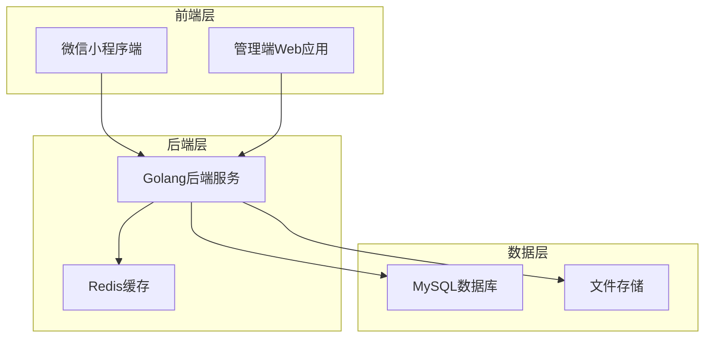
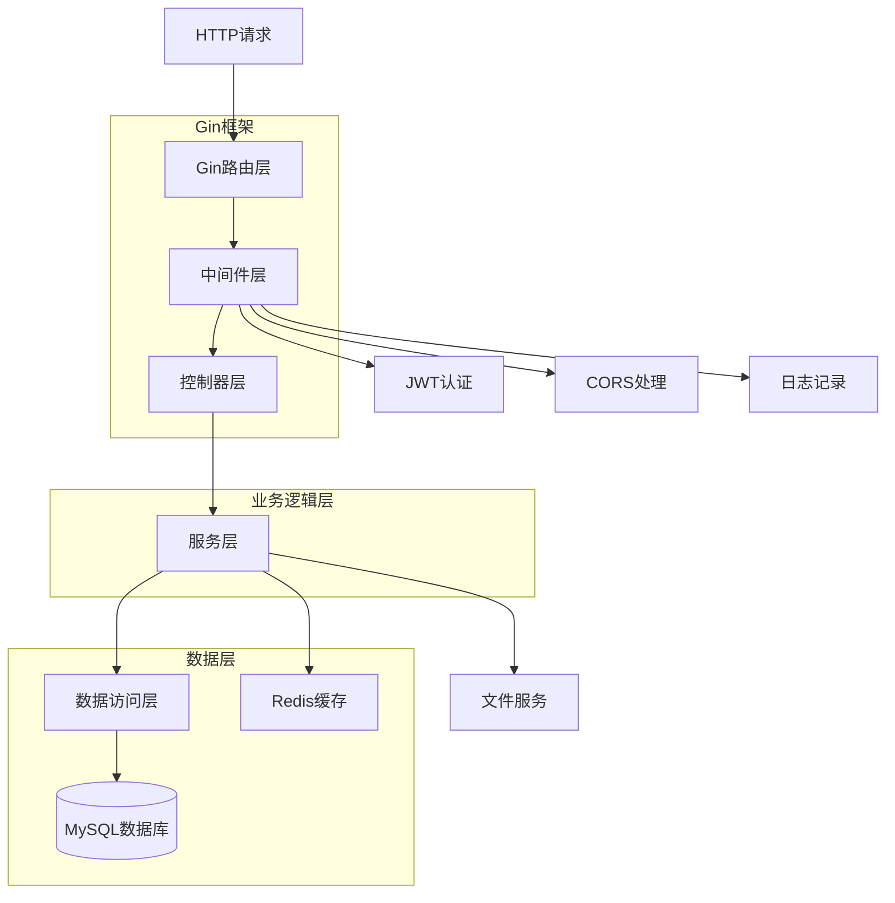
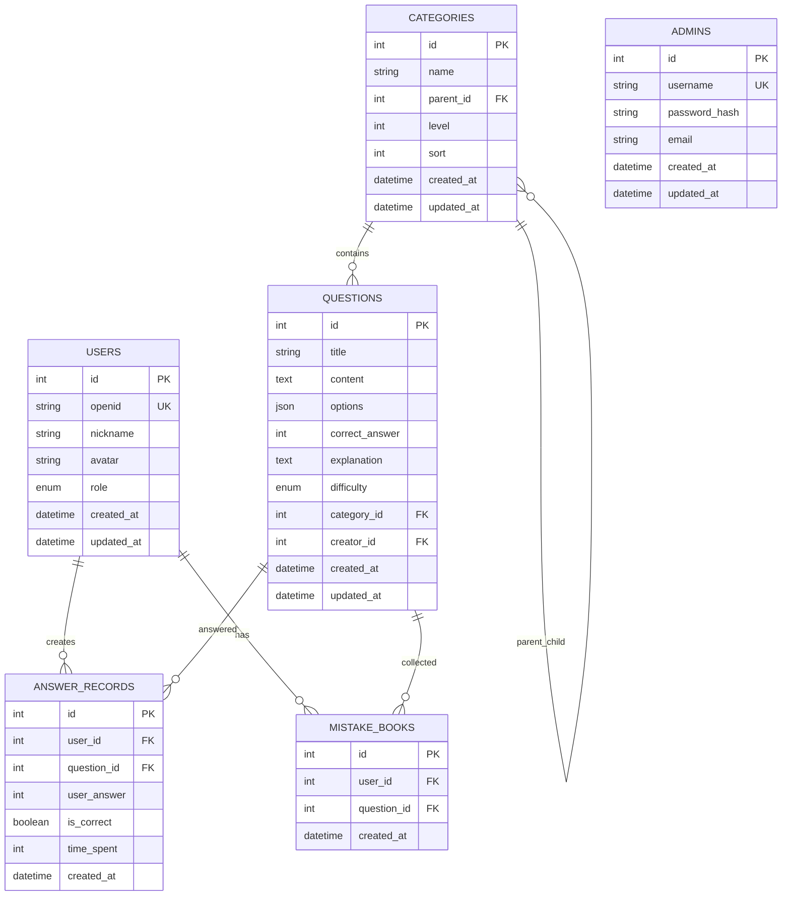

# 刷刷题微信小程序项目技术架构文档

## 1. 架构设计



## 2. 技术描述

* **小程序端**：Vue3 + TypeScript + uni-app + uni-ui\@2.0.0 + SCSS

* **管理端**：Vue3 + TypeScript + Element Plus\@2.0.0 + SCSS + Vite

* **后端**：Golang + Gin + GORM + JWT

* **数据库**：MySQL 8.0

* **缓存**：Redis（可选）

* **文件存储**：本地文件系统

## 3. 路由定义

### 3.1 小程序端路由

| 路由                     | 用途             |
| ---------------------- | -------------- |
| /pages/index/index     | 首页，展示题目分类和推荐题目 |
| /pages/question/detail | 题目详情页，答题和查看解析  |
| /pages/user/center     | 个人中心，用户信息和学习统计 |
| /pages/user/records    | 做题记录页面         |
| /pages/user/mistakes   | 错题本页面          |
| /pages/category/list   | 分类页面，按分类浏览题目   |
| /pages/search/index    | 搜索页面           |
| /pages/user/settings   | 设置页面           |
| /pages/auth/login      | 登录授权页面         |

### 3.2 管理端路由

| 路由                  | 用途            |
| ------------------- | ------------- |
| /login              | 管理员登录页面       |
| /dashboard          | 仪表板，数据统计和快捷操作 |
| /questions          | 题目管理页面        |
| /questions/create   | 创建题目页面        |
| /questions/edit/:id | 编辑题目页面        |
| /categories         | 分类管理页面        |
| /users              | 用户管理页面        |
| /system             | 系统管理页面        |

## 4. API定义

### 4.1 核心API

**用户认证相关**

```
POST /api/auth/login
```

请求参数：

| 参数名      | 参数类型   | 是否必需  | 描述       |
| -------- | ------ | ----- | -------- |
| code     | string | true  | 微信登录code |
| userInfo | object | false | 用户信息     |

响应参数：

| 参数名      | 参数类型   | 描述    |
| -------- | ------ | ----- |
| token    | string | JWT令牌 |
| userInfo | object | 用户信息  |

**题目相关API**

```
GET /api/questions
GET /api/questions/:id
POST /api/questions
PUT /api/questions/:id
DELETE /api/questions/:id
```

**分类相关API**

```
GET /api/categories
POST /api/categories
PUT /api/categories/:id
DELETE /api/categories/:id
```

**答题记录API**

```
POST /api/answers
GET /api/answers/records
GET /api/answers/mistakes
```

**用户管理API**

```
GET /api/users
GET /api/users/:id
PUT /api/users/:id
```

### 4.2 数据类型定义

```typescript
// 用户类型
interface User {
  id: number;
  openid: string;
  nickname: string;
  avatar: string;
  role: 'user' | 'admin';
  createdAt: string;
  updatedAt: string;
}

// 题目类型
interface Question {
  id: number;
  title: string;
  content: string;
  options: string[];
  correctAnswer: number;
  explanation: string;
  difficulty: 'easy' | 'medium' | 'hard';
  categoryId: number;
  category?: Category;
  createdAt: string;
  updatedAt: string;
}

// 分类类型
interface Category {
  id: number;
  name: string;
  parentId: number | null;
  level: number;
  sort: number;
  children?: Category[];
}

// 答题记录类型
interface AnswerRecord {
  id: number;
  userId: number;
  questionId: number;
  userAnswer: number;
  isCorrect: boolean;
  timeSpent: number;
  createdAt: string;
}
```

## 5. 服务器架构图



## 6. 数据模型

### 6.1 数据模型定义



### 6.2 数据定义语言

**用户表 (users)**

```sql
-- 创建用户表
CREATE TABLE users (
    id INT AUTO_INCREMENT PRIMARY KEY,
    openid VARCHAR(100) UNIQUE NOT NULL COMMENT '微信openid',
    nickname VARCHAR(50) NOT NULL COMMENT '用户昵称',
    avatar VARCHAR(255) DEFAULT '' COMMENT '用户头像',
    role ENUM('user', 'admin') DEFAULT 'user' COMMENT '用户角色',
    created_at TIMESTAMP DEFAULT CURRENT_TIMESTAMP,
    updated_at TIMESTAMP DEFAULT CURRENT_TIMESTAMP ON UPDATE CURRENT_TIMESTAMP
) ENGINE=InnoDB DEFAULT CHARSET=utf8mb4 COMMENT='用户表';

-- 创建索引
CREATE INDEX idx_users_openid ON users(openid);
CREATE INDEX idx_users_role ON users(role);
```

**分类表 (categories)**

```sql
-- 创建分类表
CREATE TABLE categories (
    id INT AUTO_INCREMENT PRIMARY KEY,
    name VARCHAR(50) NOT NULL COMMENT '分类名称',
    parent_id INT DEFAULT NULL COMMENT '父分类ID',
    level TINYINT DEFAULT 1 COMMENT '分类层级',
    sort INT DEFAULT 0 COMMENT '排序',
    created_at TIMESTAMP DEFAULT CURRENT_TIMESTAMP,
    updated_at TIMESTAMP DEFAULT CURRENT_TIMESTAMP ON UPDATE CURRENT_TIMESTAMP,
    FOREIGN KEY (parent_id) REFERENCES categories(id) ON DELETE SET NULL
) ENGINE=InnoDB DEFAULT CHARSET=utf8mb4 COMMENT='题目分类表';

-- 创建索引
CREATE INDEX idx_categories_parent_id ON categories(parent_id);
CREATE INDEX idx_categories_level ON categories(level);

-- 初始化分类数据
INSERT INTO categories (name, parent_id, level, sort) VALUES
('法考题', NULL, 1, 1),
('医考题', NULL, 1, 2),
('工程类', NULL, 1, 3),
('法律基础', 1, 2, 1),
('法律条款', 1, 2, 2),
('法律解释', 1, 2, 3),
('临床医学', 2, 2, 1),
('基础医学', 2, 2, 2),
('道路工程', 3, 2, 1),
('桥隧工程', 3, 2, 2);
```

**题目表 (questions)**

```sql
-- 创建题目表
CREATE TABLE questions (
    id INT AUTO_INCREMENT PRIMARY KEY,
    title VARCHAR(200) NOT NULL COMMENT '题目标题',
    content TEXT NOT NULL COMMENT '题目内容',
    options JSON NOT NULL COMMENT '选项数组',
    correct_answer TINYINT NOT NULL COMMENT '正确答案索引',
    explanation TEXT DEFAULT '' COMMENT '答案解析',
    difficulty ENUM('easy', 'medium', 'hard') DEFAULT 'medium' COMMENT '难度等级',
    category_id INT NOT NULL COMMENT '分类ID',
    creator_id INT DEFAULT NULL COMMENT '创建者ID',
    created_at TIMESTAMP DEFAULT CURRENT_TIMESTAMP,
    updated_at TIMESTAMP DEFAULT CURRENT_TIMESTAMP ON UPDATE CURRENT_TIMESTAMP,
    FOREIGN KEY (category_id) REFERENCES categories(id) ON DELETE CASCADE,
    FOREIGN KEY (creator_id) REFERENCES users(id) ON DELETE SET NULL
) ENGINE=InnoDB DEFAULT CHARSET=utf8mb4 COMMENT='题目表';

-- 创建索引
CREATE INDEX idx_questions_category_id ON questions(category_id);
CREATE INDEX idx_questions_difficulty ON questions(difficulty);
CREATE INDEX idx_questions_creator_id ON questions(creator_id);
CREATE FULLTEXT INDEX idx_questions_content ON questions(title, content);
```

**答题记录表 (answer\_records)**

```sql
-- 创建答题记录表
CREATE TABLE answer_records (
    id INT AUTO_INCREMENT PRIMARY KEY,
    user_id INT NOT NULL COMMENT '用户ID',
    question_id INT NOT NULL COMMENT '题目ID',
    user_answer TINYINT NOT NULL COMMENT '用户答案',
    is_correct BOOLEAN NOT NULL COMMENT '是否正确',
    time_spent INT DEFAULT 0 COMMENT '答题用时(秒)',
    created_at TIMESTAMP DEFAULT CURRENT_TIMESTAMP,
    FOREIGN KEY (user_id) REFERENCES users(id) ON DELETE CASCADE,
    FOREIGN KEY (question_id) REFERENCES questions(id) ON DELETE CASCADE,
    UNIQUE KEY uk_user_question (user_id, question_id)
) ENGINE=InnoDB DEFAULT CHARSET=utf8mb4 COMMENT='答题记录表';

-- 创建索引
CREATE INDEX idx_answer_records_user_id ON answer_records(user_id);
CREATE INDEX idx_answer_records_question_id ON answer_records(question_id);
CREATE INDEX idx_answer_records_created_at ON answer_records(created_at);
```

**错题本表 (mistake\_books)**

```sql
-- 创建错题本表
CREATE TABLE mistake_books (
    id INT AUTO_INCREMENT PRIMARY KEY,
    user_id INT NOT NULL COMMENT '用户ID',
    question_id INT NOT NULL COMMENT '题目ID',
    created_at TIMESTAMP DEFAULT CURRENT_TIMESTAMP,
    FOREIGN KEY (user_id) REFERENCES users(id) ON DELETE CASCADE,
    FOREIGN KEY (question_id) REFERENCES questions(id) ON DELETE CASCADE,
    UNIQUE KEY uk_user_question (user_id, question_id)
) ENGINE=InnoDB DEFAULT CHARSET=utf8mb4 COMMENT='错题本表';

-- 创建索引
CREATE INDEX idx_mistake_books_user_id ON mistake_books(user_id);
CREATE INDEX idx_mistake_books_created_at ON mistake_books(created_at);
```

**管理员表 (admins)**

```sql
-- 创建管理员表
CREATE TABLE admins (
    id INT AUTO_INCREMENT PRIMARY KEY,
    username VARCHAR(50) UNIQUE NOT NULL COMMENT '用户名',
    password_hash VARCHAR(255) NOT NULL COMMENT '密码哈希',
    email VARCHAR(100) DEFAULT '' COMMENT '邮箱',
    created_at TIMESTAMP DEFAULT CURRENT_TIMESTAMP,
    updated_at TIMESTAMP DEFAULT CURRENT_TIMESTAMP ON UPDATE CURRENT_TIMESTAMP
) ENGINE=InnoDB DEFAULT CHARSET=utf8mb4 COMMENT='管理员表';

-- 创建索引
CREATE INDEX idx_admins_username ON admins(username);

-- 初始化管理员数据（密码：admin123）
INSERT INTO admins (username, password_hash, email) VALUES
('admin', '$2a$10$N.zmdr9k7uOCQb376NoUnuTJ8iKVjzieMwkOBSaEVFVGGvQTdO5wS', 'admin@example.com');
```

